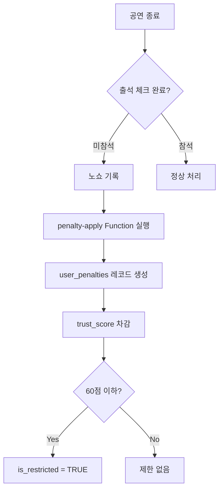

# 공연 초대권 플랫폼 MVP 기술 스펙 (1주일 완성)

**프로젝트:** Artause Performance Giveaway Platform
**목표:** Rule Engine 기반 초대권 이벤트 관리 시스템
**기간:** 7일
**완성일:** 2025-11-24

---

## 📋 목차

1. [시스템 아키텍처](#시스템-아키텍처)
2. [데이터베이스 스키마](#데이터베이스-스키마)
3. [Rule Engine 로직](#rule-engine-로직)
4. [API 설계](#api-설계)
5. [UI/UX 흐름](#uiux-흐름)
6. [구현 우선순위](#구현-우선순위)

---

## 시스템 아키텍처

```
┌─────────────────────────────────────────────────────────────┐
│                        Frontend (Next.js 15)                 │
├─────────────────────────────────────────────────────────────┤
│  /events          │  /event-center    │  /rules   │  /me    │
│  (관객 응모)       │  (파트너 관리)     │  (규칙)   │  (마이) │
└─────────────────────────────────────────────────────────────┘
                              ↓
┌─────────────────────────────────────────────────────────────┐
│                    Supabase Backend                          │
├─────────────────────────────────────────────────────────────┤
│  Auth          │  Database (PostgreSQL)  │  Edge Functions  │
│  - 파트너 로그인 │  - 캠페인, 응모자      │  - penalty-apply │
│  - 관객 세션    │  - 패널티, 신뢰도      │  - trust-check   │
└─────────────────────────────────────────────────────────────┘
                              ↓
┌─────────────────────────────────────────────────────────────┐
│                       Rule Engine                            │
├─────────────────────────────────────────────────────────────┤
│  노쇼 감지 → 패널티 부여 → 신뢰도 차감 → 응모 제한          │
└─────────────────────────────────────────────────────────────┘
```

---

## 데이터베이스 스키마

### 1. 기존 테이블 (이미 존재)
- `users` - 사용자 (member/partner/admin)
- `event_campaigns` - 이벤트 캠페인
- `entries` - 응모 내역
- `performances` - 공연 정보

### 2. 신규 테이블 (추가 필요)

#### `user_penalties` - 패널티 기록
```sql
CREATE TABLE user_penalties (
  id UUID PRIMARY KEY DEFAULT uuid_generate_v4(),
  user_id UUID REFERENCES users(id) ON DELETE CASCADE,
  entry_id UUID REFERENCES entries(id) ON DELETE SET NULL,
  campaign_id UUID REFERENCES event_campaigns(id),

  penalty_type TEXT NOT NULL,
  -- 'no_show': 노쇼
  -- 'late_cancel': 3일 이내 취소
  -- 'rule_violation': 규칙 위반

  points INT NOT NULL DEFAULT 10,
  reason TEXT,

  -- 패널티 만료일 (예: 6개월 후 자동 삭제)
  expires_at TIMESTAMPTZ DEFAULT (NOW() + INTERVAL '6 months'),

  created_at TIMESTAMPTZ DEFAULT NOW(),
  created_by UUID REFERENCES users(id) -- 파트너가 수동 부여한 경우
);

CREATE INDEX idx_user_penalties_user ON user_penalties(user_id);
CREATE INDEX idx_user_penalties_expires ON user_penalties(expires_at);
```

#### `campaign_rules` - 캠페인별 규칙
```sql
CREATE TABLE campaign_rules (
  id UUID PRIMARY KEY DEFAULT uuid_generate_v4(),
  campaign_id UUID REFERENCES event_campaigns(id) ON DELETE CASCADE,

  rule_type TEXT NOT NULL,
  -- 'cancel_deadline': 취소 마감 기한
  -- 'attendance_required': 출석 필수
  -- 'no_transfer': 양도 불가

  config JSONB NOT NULL,
  -- { "days_before": 3, "penalty_points": 10 }
  -- { "required": true, "penalty_points": 20 }

  is_active BOOLEAN DEFAULT TRUE,
  created_at TIMESTAMPTZ DEFAULT NOW()
);

CREATE INDEX idx_campaign_rules_campaign ON campaign_rules(campaign_id);
```

### 3. 기존 테이블 수정

#### `users` 테이블에 신뢰도 점수 추가
```sql
ALTER TABLE users
  ADD COLUMN trust_score INT DEFAULT 100,
  ADD COLUMN is_restricted BOOLEAN DEFAULT FALSE,
  ADD COLUMN restriction_reason TEXT,
  ADD COLUMN restriction_until TIMESTAMPTZ;

-- 인덱스 추가
CREATE INDEX idx_users_trust_score ON users(trust_score);
CREATE INDEX idx_users_restricted ON users(is_restricted);
```

#### `entries` 테이블에 상태 추가
```sql
ALTER TABLE entries
  ADD COLUMN is_cancelled BOOLEAN DEFAULT FALSE,
  ADD COLUMN cancelled_at TIMESTAMPTZ,
  ADD COLUMN cancellation_reason TEXT;

CREATE INDEX idx_entries_cancelled ON entries(is_cancelled);
```

---

## Rule Engine 로직

### 1. 신뢰도 점수 시스템

**기본 점수:** 100점
**제한 기준:** 60점 이하 → 응모 제한

| 행동 | 점수 변화 | 만료 기간 |
|------|----------|----------|
| 노쇼 (no_show) | -20점 | 6개월 |
| 3일 이내 취소 (late_cancel) | -10점 | 6개월 |
| 규칙 위반 (rule_violation) | -15점 | 6개월 |
| 정상 참석 (보너스) | +5점 | - |

### 2. 패널티 부여 워크플로우



### 3. 응모 제한 로직

**응모 시 체크 항목:**
1. `users.is_restricted = FALSE`
2. `users.trust_score >= 60`
3. 활성 패널티 건수 < 3개

```typescript
// 응모 가능 여부 체크
function canApply(user: User, penalties: Penalty[]): boolean {
  if (user.is_restricted) return false;
  if (user.trust_score < 60) return false;

  const activePenalties = penalties.filter(p =>
    p.expires_at > new Date()
  );

  if (activePenalties.length >= 3) return false;

  return true;
}
```

### 4. 3일 전 취소 제한

```typescript
function canCancel(entry: Entry, campaign: Campaign): boolean {
  const showDate = new Date(campaign.show_date);
  const now = new Date();
  const daysUntilShow = (showDate.getTime() - now.getTime()) / (1000 * 60 * 60 * 24);

  return daysUntilShow > 3;
}
```

---

## API 설계

### Edge Functions

#### 1. `penalty-apply` - 패널티 부여
**트리거:** 파트너가 노쇼 처리 버튼 클릭
**Input:**
```json
{
  "entry_id": "uuid",
  "penalty_type": "no_show",
  "points": 20,
  "reason": "공연 당일 미출석"
}
```

**Output:**
```json
{
  "success": true,
  "penalty_id": "uuid",
  "new_trust_score": 80,
  "is_restricted": false
}
```

**로직:**
1. `user_penalties` 레코드 생성
2. `users.trust_score` 차감
3. 60점 이하 → `is_restricted = TRUE`
4. `entries.attendance_status = 'no_show'` 업데이트

#### 2. `trust-score-check` - 응모 자격 확인
**트리거:** 응모 폼 제출 전
**Input:**
```json
{
  "user_id": "uuid"
}
```

**Output:**
```json
{
  "can_apply": true,
  "trust_score": 95,
  "active_penalties": 0,
  "restriction_reason": null
}
```

#### 3. `penalty-expire` - 만료된 패널티 정리
**트리거:** 매일 자동 실행 (Cron)
**로직:**
1. `expires_at < NOW()` 패널티 삭제
2. 남은 패널티로 trust_score 재계산
3. 제한 해제 가능 여부 확인

### Server Actions

#### 1. `submitTicketEntry` - 응모 제출
```typescript
// src/app/events/tickets/[slug]/actions.ts
export async function submitTicketEntry(formData: FormData) {
  // 1. 사용자 자격 확인
  const { can_apply } = await checkTrustScore(userId);
  if (!can_apply) {
    return { success: false, error: '응모 자격이 제한되었습니다.' };
  }

  // 2. 규칙 동의 확인
  const rulesAgreed = formData.get('rules_agreed');
  if (!rulesAgreed) {
    return { success: false, error: '이용 규칙에 동의해주세요.' };
  }

  // 3. 응모 제출
  const entry = await createEntry({...});
  return { success: true, entry_id: entry.id };
}
```

#### 2. `cancelEntry` - 응모 취소
```typescript
export async function cancelEntry(entryId: string) {
  const entry = await getEntry(entryId);
  const campaign = await getCampaign(entry.campaign_id);

  // 3일 전 체크
  if (!canCancel(entry, campaign)) {
    return {
      success: false,
      error: '공연 3일 전부터는 취소할 수 없습니다.'
    };
  }

  await updateEntry(entryId, { is_cancelled: true });
  return { success: true };
}
```

#### 3. `applyPenalty` - 패널티 부여 (파트너)
```typescript
// src/app/event-center/actions.ts
export async function applyPenalty(data: PenaltyData) {
  const { entry_id, penalty_type, points } = data;

  // Edge Function 호출
  const result = await fetch('/functions/penalty-apply', {
    method: 'POST',
    body: JSON.stringify({ entry_id, penalty_type, points })
  });

  return result.json();
}
```

---

## UI/UX 흐름

### 1. 관객 응모 흐름

```
/events
  → 이벤트 카드 클릭
  → /events/tickets/[slug]
  → 응모 폼 작성
  → [이용 규칙 동의 체크박스] ← 신규
  → 제출
  → trust_score 체크 ← 신규
  → 응모 완료 / 제한 메시지
```

**제한된 사용자 UI:**
```tsx
{!canApply && (
  <Alert variant="destructive">
    <AlertTriangle className="h-4 w-4" />
    <AlertTitle>응모 자격 제한</AlertTitle>
    <AlertDescription>
      신뢰도 점수가 낮아 응모가 제한되었습니다. (현재 점수: {trustScore}점)
      <Link href="/me/penalties">패널티 내역 보기</Link>
    </AlertDescription>
  </Alert>
)}
```

### 2. 파트너 노쇼 처리 흐름

```
/event-center
  → AttendanceConsole
  → 당첨자 명단
  → [노쇼 처리] 버튼 클릭 ← 신규
  → 확인 모달
  → applyPenalty() 실행
  → 패널티 부여 완료
```

**노쇼 처리 UI:**
```tsx
<Button
  variant="destructive"
  onClick={() => handleNoShow(guest.id)}
>
  노쇼 처리 (-20점)
</Button>
```

### 3. 이용 규칙 페이지

**URL:** `/rules`

**섹션:**
1. **응모 및 선정 규칙**
   - 1인 1회 응모
   - 무작위 추첨
   - 당첨 시 이메일 발송

2. **취소 정책**
   - 공연 3일 전까지만 취소 가능
   - 3일 이내 취소 시 -10점

3. **출석 규칙**
   - 공연 당일 필수 출석
   - 노쇼 시 -20점
   - 신뢰도 60점 이하 → 응모 제한

4. **패널티 시스템**
   - 패널티는 6개월 후 자동 만료
   - 정상 참석 시 +5점 보너스
   - 제한 해제 조건

### 4. 마이페이지 - 패널티 내역

**URL:** `/me/penalties`

```tsx
<div>
  <h2>신뢰도 점수: {trustScore}점</h2>
  {isRestricted && (
    <Badge variant="destructive">응모 제한 중</Badge>
  )}

  <PenaltyList penalties={activePenalties} />

  <Timeline>
    {penaltyHistory.map(p => (
      <TimelineItem>
        <Badge>{p.penalty_type}</Badge>
        <span>{p.reason}</span>
        <span>-{p.points}점</span>
        <span>만료: {p.expires_at}</span>
      </TimelineItem>
    ))}
  </Timeline>
</div>
```

---

## 구현 우선순위

### Day 1-2: DB & Backend
- [ ] DB 마이그레이션 작성 (`supabase/migrations/20251117_rule_engine.sql`)
- [ ] Edge Function: `penalty-apply`
- [ ] Edge Function: `trust-score-check`
- [ ] Server Action: `submitTicketEntry` 수정 (trust_score 체크)
- [ ] Server Action: `applyPenalty` 신규

### Day 3-4: 파트너 UI
- [ ] `AttendanceConsole` 수정 - 노쇼 처리 버튼
- [ ] 패널티 부여 확인 모달
- [ ] 당첨자 명단에 패널티 이력 표시
- [ ] 테스트: 노쇼 처리 → 점수 차감 → 제한 적용

### Day 5-6: 관객 UI
- [ ] `/rules` 페이지 생성
- [ ] 응모 폼에 규칙 동의 체크박스
- [ ] 제한된 사용자 안내 메시지
- [ ] `/me/penalties` 페이지 생성
- [ ] 취소 기능 수정 (3일 전 체크)

### Day 7: 테스트 & 배포
- [ ] E2E 테스트 시나리오
  - 노쇼 → 패널티 → 제한 → 응모 차단
  - 3일 이내 취소 시도 → 거부
  - 만료된 패널티 정리
- [ ] 프로덕션 배포
- [ ] 모니터링 설정

---

## 기술 스택

- **Frontend:** Next.js 15 (App Router), React 19, TailwindCSS v4
- **Backend:** Supabase (PostgreSQL, Auth, Edge Functions)
- **Language:** TypeScript
- **Validation:** Zod
- **Testing:** Vitest, Playwright (E2E)
- **Deployment:** Vercel

---

## 성공 지표

**MVP 완성 기준:**
1. ✅ 노쇼 발생 시 자동 패널티 부여
2. ✅ 신뢰도 60점 이하 사용자 응모 차단
3. ✅ 3일 전 취소 제한 작동
4. ✅ 이용 규칙 페이지 표시
5. ✅ 패널티 내역 조회 가능

**테스트 시나리오:**
- [ ] 사용자 A가 노쇼 → 20점 차감 → 80점
- [ ] 사용자 A가 다시 노쇼 2회 → 40점 → 응모 제한
- [ ] 사용자 B가 3일 이내 취소 시도 → 거부
- [ ] 6개월 후 패널티 만료 → 점수 복구

---

**마지막 업데이트:** 2025-11-17
**담당자:** Claude Code
**상태:** 스펙 완료, 구현 시작 준비 완료
